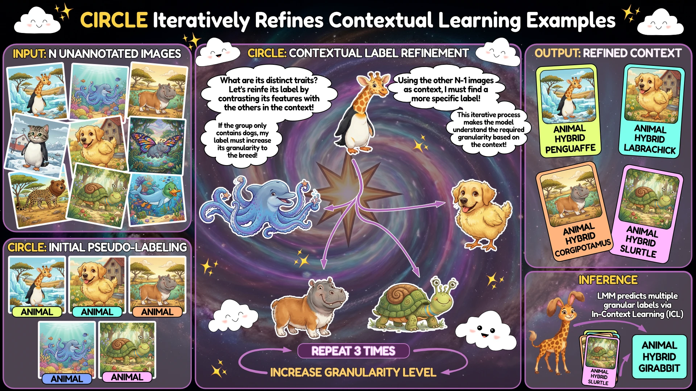

<div align="center">

<a href="https://www.python.org"></a>
<a href="https://pytorch.org/get-started/locally/"></a>
<a href="https://cvpr.thecvf.com/Conferences/2026"></a>

<h1>Large Multimodal Models as General In-Context Classifiers</h1>

[Marco Garosi](https://scholar.google.com/citations?user=fYOJC6UAAAAJ) · [Matteo Farina](https://scholar.google.com/citations?user=G9CXKEYAAAAJ) · [Alessandro Conti](https://scholar.google.com/citations?user=EPImyCcAAAAJ) · [Massimiliano Mancini](https://scholar.google.com/citations?user=bqTPA8kAAAAJ) · [Elisa Ricci](https://scholar.google.com/citations?user=xf1T870AAAAJ)

University of Trento  |  Fondazione Bruno Kessler

<a href="https://circle-lmm.github.io"></a>
<a href="https://arxiv.org/abs/2602.23229"></a>

<br>



</div>

______________________________________________________________________

## Table of Contents

- [Abstract](#abstract)
- [Method](#method)
- [Setup](#setup)
  - [Install dependencies](#install-dependencies)
  - [Setup environment variables](#setup-environment-variables)
- [Usage](#usage)
  - [Overview](#overview)
  - [Running model evaluations](#running-model-evaluations)
  - [Compute metrics](#compute-metrics)
  - [Clone configurations](#clone-configurations)
  - [Embedding datasets](#embedding-datasets)
  - [Enabling FlashAttention](#enabling-flashattention)
- [Development](#development)
- [Citation](#citation)
- [Acknowledgements](#acknowledgements)

______________________________________________________________________

## Abstract

Which multimodal model should we use for classification? Previous studies suggest that the answer lies in CLIP-like contrastive Vision-Language Models (VLMs), due to their remarkable performance in zero-shot classification. In contrast, Large Multimodal Models (LMMs) are more suitable for complex tasks. In this work, we argue that this answer overlooks an important capability of LMMs: **in-context learning**. We benchmark state-of-the-art LMMs on diverse datasets for closed-world classification and find that, although their zero-shot performance is lower than CLIP's, **LMMs with a few in-context examples can match or even surpass contrastive VLMs** with cache-based adapters, their "in-context" equivalent. We extend this analysis to the open-world setting, where the generative nature of LMMs makes them more suitable for the task. In this challenging scenario, LMMs struggle whenever provided with imperfect context information. To address this issue, we propose **CIRCLE**, a simple training-free method that assigns pseudo-labels to in-context examples, iteratively refining them with the available context itself. Through extensive experiments, we show that CIRCLE establishes a robust baseline for open-world classification, surpassing VLM counterparts and highlighting the potential of LMMs to serve as unified classifiers, and a flexible alternative to specialized models.

______________________________________________________________________

## Method

CIRCLE operates in three stages to build a rich in-context representation from a set of unlabeled support images:

1. **Pseudo-labeling** — The LMM independently assigns an initial pseudo-label to each support image, without seeing other examples.
2. **Iterative Refinement** — For each image, CIRCLE updates its label by conditioning on all other images and their current labels. By focusing on the *differences* between examples, the model narrows the label space and converges toward the correct granularity. This step is repeated for multiple iterations.
3. **In-context Inference** — The refined `(image, label)` pairs form a structured context. At inference time, the LMM classifies new images by leveraging this autonomously built context.

______________________________________________________________________

## Setup

### Install dependencies

```bash
# clone project
git clone https://github.com/marco-garosi/CIRCLE
cd CIRCLE

# (recommended) use uv to set up the python version
# and to install the required dependencies
curl -LsSf https://astral.sh/uv/install.sh | sh
uv sync --frozen

# (alternative) use conda to set up the python version
# and pip to install the required dependencies
conda create --name py3.12 python=3.12
conda activate py3.12
python -m venv .venv
.venv/bin/python3 -m pip install -e .

# activate virtual environment
source .venv/bin/activate
```

### Setup environment variables

```bash
# copy .env.example to .env and fill in your credentials
cp .env.example .env
vim .env
```

The `.env` file supports the following keys:

| Variable            | Description                                      |
| ------------------- | ------------------------------------------------ |
| `HF_TOKEN`          | HuggingFace token (for gated models)             |
| `WANDB_API_KEY`     | Weights & Biases API key (optional, for logging) |
| `RAG_DATABASE_ROOT` | Path to the embedded documents database          |

______________________________________________________________________

## Usage

Once the environment is set up, you can run evaluations and analyses using the provided scripts and entrypoints.

> **TL;DR**
>
> - Use `--help` on any script to explore its options.
> - Use `scripts/schedule_batch.sh` for **local sequential runs**.
> - Use `scripts/schedule_sbatch.sh` for **distributed Slurm runs**.
> - Compute metrics **offline** when possible.

### Overview

The repository provides three main entrypoints:

| Script            | Purpose                                                                           |
| ----------------- | --------------------------------------------------------------------------------- |
| `eval_model.py`   | Runs evaluations of large multimodal models on the tasks.                         |
| `eval_metrics.py` | Computes metrics offline for previously obtained predictions.                     |
| `eval_ranking.py` | Computes *Elo-style rankings* across models based on pairwise evaluation results. |

In addition, two helper scripts (`scripts/schedule_batch.sh` and `scripts/schedule_sbatch.sh`) simplify large-scale or distributed experiment scheduling.

### Running model evaluations

You can run model evaluations directly:

```bash
python eval_model.py --model <model_name> --tasks <task_name>
```

or use one of the wrapper scripts below for running larger sets of experiments.

#### `scripts/schedule_batch.sh`

Runs multiple model–task pairs **sequentially** on a single machine (*e.g.*, local or private server).

```bash
bash scripts/schedule_batch.sh --models qwen2-vl-7b --tasks caltech101,dtd,food101
```

| Option         | Description                                                                   |
| -------------- | ----------------------------------------------------------------------------- |
| `--models`     | Comma-separated list of models to evaluate.                                   |
| `--tasks`      | Comma-separated list of tasks to evaluate on.                                 |
| `--limit`      | Limit the number of samples per task.                                         |
| `--model-args` | Extra comma-separated arguments for the models.                               |
| `--batch-size` | Specify batch size. Note: not all models support a batch size greater than 1. |
| `--no-samples` | Disable saving of sample predictions to disk.                                 |
| `--no-wandb`   | Disable Weights & Biases logging.                                             |
| `--output`     | Output directory for results (default: `logs/schedule`).                      |

#### `scripts/schedule_sbatch.sh`

Submits **parallel jobs** to a Slurm cluster (one per model–task pair), enabling distributed evaluations across multiple GPUs.

```bash
bash scripts/schedule_sbatch.sh --partition gpu --gpu a100.40:8 --models qwen2-vl-2b,qwen2-vl-7b --tasks flowers102,ucf101
```

**Slurm options:**

| Option                              | Description                                                                   |
| ----------------------------------- | ----------------------------------------------------------------------------- |
| `--partition`, `--account`          | Slurm partition and account to use.                                           |
| `--cpu`, `--gpu`, `--mem`, `--time` | Resource allocation per job (default: 12 CPUs, 8×A100 GPUs, 128 GB RAM, 2 h). |
| `--nodes`, `--name`                 | Number of nodes and job name.                                                 |

**Evaluation options:** identical to `schedule_batch.sh`.

Each evaluation automatically downloads the required models and datasets (if not already cached) and stores logs and predictions in the `logs/` directory.

### Compute metrics

After evaluations are complete, you can compute the metrics for the generated predictions:

```bash
python eval_metrics.py -i logs/schedule/ -m textual_inclusion_llama32,median_concept_semantic_similarity,textual_iou,concept_semantic_similarity,semantic_similarity
```

You can also use glob patterns to select specific experiments:

```bash
# Example: evaluate all experiments whose names end with "_circle"
python eval_metrics.py -i "logs/schedule/*_circle/" -m textual_inclusion_llama32,median_concept_semantic_similarity,textual_iou,concept_semantic_similarity,semantic_similarity
```

Metrics can be evaluated **online** (during model evaluation) or **offline** (in a separate post-processing step). While most lightweight metrics can be computed online, it is recommended to run **model-based metrics** offline, as they typically execute on a **single GPU**. Running them separately avoids underutilizing resources when using multi-GPU setups (*e.g.*, 8 GPUs allocated for `eval_model`).

By default, the repository **excludes `textual_inclusion_llama32` from online evaluation**, as it is a model-based metric and is evaluated offline.

### Clone configurations

`clone_configs.py` is a utility for creating new experiment configurations without starting from scratch. Given a base config and a JSON diff file, it applies the delta to every task under `src/data/tasks/_classification/` and writes the resulting configs alongside the originals.

```bash
# Suffix mode
python clone_configs.py \
  --base-config "<base_config_name>" \
  --new-config "suffix"

# Replacement mode
python clone_configs.py \
  --base-config "<base_config_name>" \
  --new-config ">replacement"
```

The `--new-config` argument controls the output filename:

- **Suffix mode** (default): the new config is named `<base_config><new_config>.yaml`.
- **Replacement mode** (prefix with `>`): the new config is named `<new_config>.yaml`, discarding the base name.

You can also specify the new task name, which is the name used to invoke the task from the command line interface.
You can do so by using `--new-task-name`: if specified, the `task` key is replaced by the dataset name and the given value; if it is not specified (default), the value of `--new-config` is used.
For example: `--new-task-name "test_1"` would result, on Caltech 101, in a task named `caltech101_test_1`.

| Option              | Description                                                                                                                  |
| ------------------- | ---------------------------------------------------------------------------------------------------------------------------- |
| `--base-config`     | Name of the base config to clone (without `.yaml`). Required.                                                                |
| `--new-config`      | Output name suffix, or full replacement if prefixed with `>`. Required.                                                      |
| `--new-task-name`   | Override the `task` field in the resulting config. The dataset's name (base task name, *e.g.*, `caltech101`) is always kept. |
| `--diff`            | Path to the JSON file containing the fields to override (default: `config-diff.json`).                                       |
| `--update-existing` | If set, overwrites configs that already exist.                                                                               |
| `--dry-run`         | Prints what would be created/updated without writing any files.                                                              |

The diff file is a plain JSON object whose keys mirror the YAML structure of the base config.
The special `$TASK_NAME` placeholder can be used. It is automatically substituted with the name of each task directory.

### Embedding datasets

To embed the training sets of the classification tasks (*i.e.*, the ten datasets), the `<task>_embed_train` tasks can be used.
For example, to embed `caltech101`'s training set using CLIP ViT-B/32, the following command can be used:

```bash
bash scripts/schedule_batch.sh --models clip-vit-b32-openai --tasks caltech101_embed_train --batch-size 128
```

### Enabling FlashAttention

If your GPUs support **FlashAttention**, you can enable it by installing the corresponding extra dependencies:

```bash
uv sync --frozen --extra nvidia --no-build-isolation
```

> ⚠️ **Note:** FlashAttention should only be installed on compatible NVIDIA hardware.
> Attempting to install it on unsupported GPUs may result in build errors or degraded performance.

This setup enables GPU-specific optimizations that can significantly improve inference speed during model evaluation. We refer to the [Flash-Attention repository](https://github.com/Dao-AILab/flash-attention) for detailed installation instructions.

______________________________________________________________________

## Development

```bash
# install dev dependencies
uv sync --frozen --extra dev

# (alternative) if you have installed dependencies with pip
.venv/bin/python3 -m pip install -e .[dev]

# install pre-commit hooks
pre-commit install

# run tests
make test

# run linters
make format

# remove autogenerated files
make clean

# remove logs
make clean-logs
```

______________________________________________________________________

## Citation

If you find this work useful, please consider citing:

```bibtex
@inproceedings{garosi2026circle,
  title     = {Large Multimodal Models as General In-Context Classifiers},
  author    = {Garosi, Marco and Farina, Matteo and Conti, Alessandro and
               Mancini, Massimiliano and Ricci, Elisa},
  booktitle = {Proceedings of the IEEE/CVF Conference on Computer Vision
               and Pattern Recognition Findings},
  year      = {2026}
}
```

______________________________________________________________________

## Acknowledgements

We thank [altndrr/lmms-owc](https://github.com/altndrr/lmms-owc) for their repository on LMMs for open-world classification, which served as a starting point for this codebase. Alessandro's codebase is based on [EvolvingLMMs-Lab/lmms-eval](https://github.com/EvolvingLMMs-Lab/lmms-eval), a repository for benchmarking large multimodal models.
